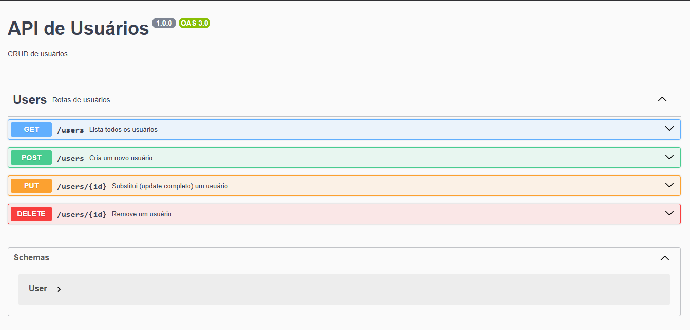

# api_usuarios

API para gerenciamento de usuários, desenvolvida em **Node.js**.

## Como Executar

1. Clone o repositório:

```bash
git clone https://github.com/davihorn/api_usuarios.git
cd api-usuarios
```

2. Instale as dependências:

```bash
npm install
```

3. Inicie a API localmente:

```bash
npm run dev
```

A API estará disponível em **`http://localhost:3333`**.

Exemplos de Uso com `curl`

### Criar um usuário

```bash
curl -X POST http://localhost:3333/api-docs \
  -H "Content-Type: application/json" \
  -d '{
    "nome": "Davi",
    "sobrenome": "Golias",
    "idade": 30,
    "profissao": "Desenvolvedor",
    "cidade": "Pato Branco",
    "estado": "PR"
  }'
```

### Listar todos os usuários

```bash
curl http://localhost:3333/api-docs
```

### Buscar usuário por ID

```bash
curl http://localhost:3333/api-docs/{id}
```

Deletar usuário por ID
```bash
curl -X DELETE "http://localhost:3333/api-docs/{id}"
```
Estrutura do Usuário

Cada usuário cadastrado segue o seguinte modelo de dados:

- `id`: UUID único (gerado automaticamente)
- `nome`: texto, mínimo 2 caracteres
- `sobrenome`: texto, mínimo 2 caracteres
- `idade`: número inteiro (0 a 120)
- `profissao`: texto, mínimo 2 caracteres
- `cidade`: texto, mínimo 2 caracteres
- `estado`: sigla de 2 letras 

---

## Status de Erros

* `201`: Criado com Sucesso
* `204`: Operação concluída porém sem conteúdo
* `400`: Erros de Validação
* `404`: Recurso não encontrado

---

## Swagger 

